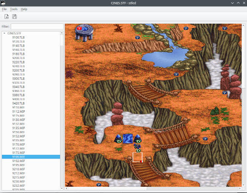
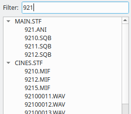
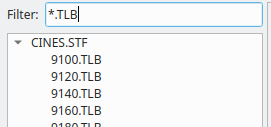
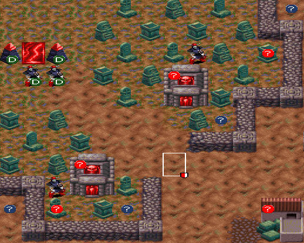

#  stfed

stfed is an asset viewer (and, in the future, editor, hence the -ed part) for the STF virtual filesystem format used in Blood and Magic by Tachyon Studios.

Beware, this program in a very early stage of development, more of a proof of concept really.



## How to run

stfed requires make, python 3.8 and QT6 to run.

When you have cloned the repo for the first time set up virtualenv and install pip dependencies with:

```
make
```

Then you can start the app by running:

```
make run
```

There's also a Dockerfile provided in case you're into that:

```
docker run -e DISPLAY=$DISPLAY -v ~/.Xauthority:/root/.Xauthority --network host $(docker build --quiet .)
```

## Usage

### Filtering resources

You can narrow down resources displayed in the list by typing initial digits of the resource name:



You can also use `*` to find resources of a specific type:



## Map previews

In the map preview image stfed uses icons to mark places of special interest:



 - AI will occasionally send a unit to guard this tile

 - a random item might be placed here when a level is started

 - this structure might drop a random item when it is destroyed

 - this unit's location is approximate; it will be placed randomly near player's Bloodforge

## Supported resource types

| Format | Can preview | Can export | Extra export formats | Can import | Extra import formats | Can edit |
| ------ | ----------- | ---------- | -------------------- | ---------- | -------------------- | -------- |
| ANI    | ✓           | ✓          | png                  | ✓          |                      |          |
| BNK    |             | ✓          |                      | ✓          |                      |          |
| CEL    |             | ✓          |                      | ✓          |                      |          |
| DAT    |             | n/a        |                      | n/a        |                      |          |
| FON    | ✓           | ✓          | png                  | ✓          |                      |          |
| HMP    |             | ✓          | mid                  | ✓          |                      |          |
| MIF    | ✓           | ✓          |                      | ✓          |                      |          |
| PAL    | ✓           | ✓          | png                  | ✓          |                      |          |
| SAV    |             | n/a        |                      | n/a        |                      |          |
| SCR    |             | n/a        |                      | n/a        |                      |          |
| SMK    |             | n/a        |                      | n/a        |                      |          |
| SQB    | ✓           | ✓          | json                 | ✓          | json                 |          |
| TLB    | ✓           | ✓          |                      | ✓          |                      |          |
| WAV    | ✓           | ✓          |                      | ✓          |                      |          |

### ANI

A sequence of [CEL](#cel) resources, usually, but not necessarily, representing an animation.

### BNK

These are [version 0.0 of Ad Lib BNK Format](https://moddingwiki.shikadi.net/wiki/AdLib_Instrument_Bank_Format#Human_Machine_Interfaces_version_.28.22Version_0.0.22.29). 1.BNK is the melodic, and 2.BNK the drums bank.
Can be loaded in [OPL3BankEditor](https://github.com/Wohlstand/OPL3BankEditor).

### CEL

A single image, stored as an unpadded sequence of 8-bit pixels. Palettes are kept separate in [PAL](#pal) resources.
There are no standalone CEL resources in BAM, all are wrapped in [ANI](#ani)s.

### FON

A bitmap font, using unpadded 8-bit pixels like [ANI](#ani)/[CEL](#cel) resources, but with a different header structure.

### HMP

[Human Machine Interfaces MIDI Format](http://www.vgmpf.com/Wiki/index.php?title=HMP), first revision - starting with HMIMIDIP013195 magic number.
Can be played directly in [wildmidi](https://github.com/Mindwerks/wildmidi) which uses Gravis soundfont,
or converted to regular MIDI with kode54's [tomid](https://github.com/kode54/tomid) and played in a OPL3 emulator such as [ADLMidi](https://bisqwit.iki.fi/source/adlmidi.html) for a fuller sound.


### MIF

Stores information about a particular map. Maps are grouped by the region in which they take place; XXX0.MIF being the blue/default, XXX5.MIF the red, and XXX2.MIF the legendary campaign variant,
and all three maps share the same [palette](#pal), XXX0.PAL, and [tileset](#tlb) (XXX0 - 10).TLB. For instance, the Serpent Valley region maps are 9130.MIF for Rathgar's campaign, 9135.MIF for Aelric's, and 9132.MIF in the legendary campaign, all three use the 9100.PAL palette, and the 9120.TLB tileset.

### PAL

A palette encoded as an unpadded sequence of 24-bit RGB pixels. All palettes apart from 666.PAL share the initial 192 entries. Entry #254 seems to be used as the transparent color.
The shades of colors used for differentiating units of the opposite sides are kept in 9101.PAL (curiously, after the red, blue, yellow and purple blocks, there is another, green one which cannot be selected in the legendary campaign mode) and copied over the region's palette when playing a game,
entries #192-200 representing the player's, and #201-209 the computer's unit colors.

### SMK/SCR

Video played during the cutscenes is encoded in RAD Game Tools Smacker format.
Note that the audio and subtitles are stored in separate [WAV](#wav) and [SQB](#sqb) resources.
Can be decoded with ffmpeg.

### SQB

Contain localized text strings. They come in groups of three, XXX0.SQB for English, XXX1.SQB for German, and XXX2.SQB for French. All use CP437/OEM-US codepage.

### TLB

A tileset for a particular region, shared by all [MIF](#mif)s that take place there.

### WAV

Just regular WAVE files, which can be opened in any audio editor. Sound effects in BAM are in 8-bit mono, either 11.5kHz or 22.1kHz. There is also some digitized music in 22.1kHz stereo.

## Acknowledgements

The code for HMP->MIDI conversion was based on Christopher "kode54" Snowhill's [midi_processing](https://github.com/kode54/midi_processing/blob/d7ce6c3e019d22023078a9226870df73a99c6fd4/midi_processor_hmp.cpp) library.

stfed bundles a subset of [Breeze icons](https://invent.kde.org/frameworks/breeze-icons) for OSes that don't have them.
